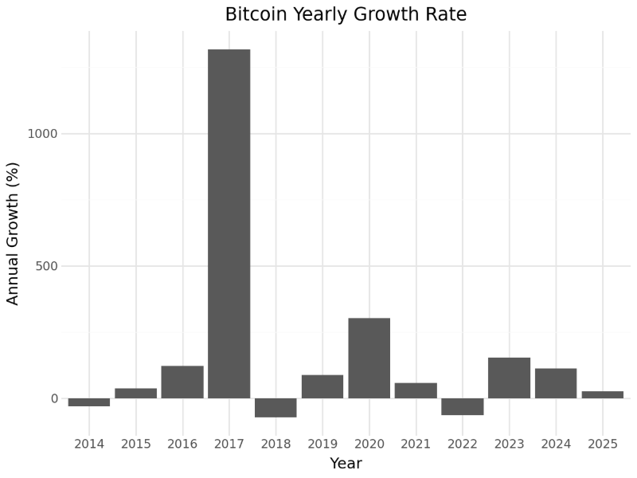
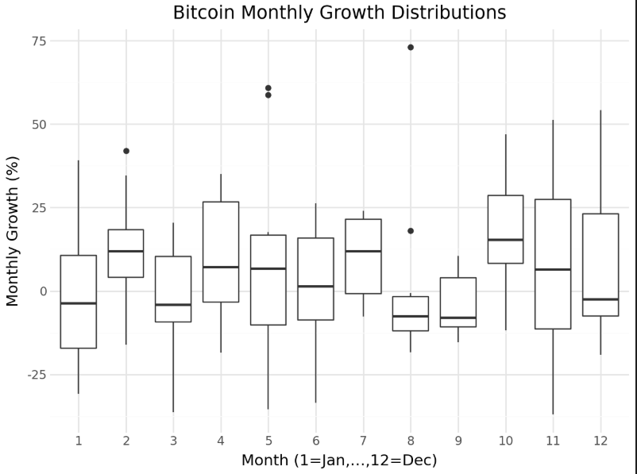
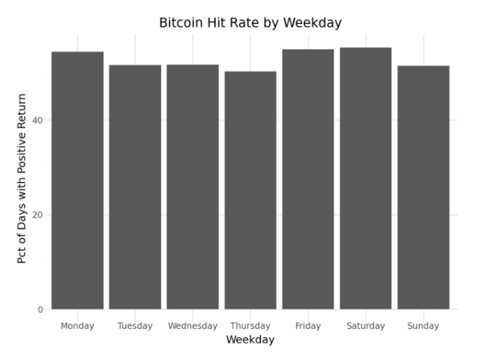
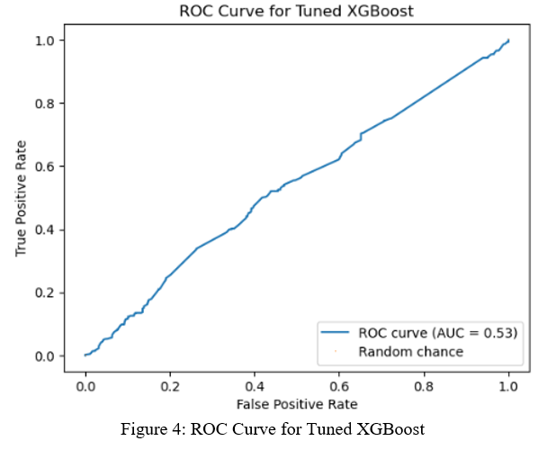

# Bitcoin Trend Signal Predictability

Tools: Python, pandas, scikit-learn, XGBoost, matplotlib, statistical testing

This project investigates whether simple Bitcoin daily trend indicators can predict next-day price direction.

The analysis uses daily BTC-USD data from 2014 to 2025 and tests whether common technical indicators such as up-candle direction, SMA-7, SMA-21, and RSI-14 contain enough predictive signal to support a trading strategy.

## Project Overview

The project focuses on three questions:

- Do Bitcoin returns show monthly or weekday patterns?
- Can simple technical indicators predict next-day direction?
- Are any detected patterns economically useful after considering trading costs?

## Methods Used

- Data cleaning and preprocessing
- Feature engineering
- Exploratory data analysis
- Monthly and weekday seasonality analysis
- Statistical testing
- Logistic regression
- Decision tree
- Random forest
- XGBoost
- ROC AUC evaluation
- Model comparison

## Features Engineered

- Positive candle flag
- 7-day simple moving average
- 21-day simple moving average
- 14-day RSI
- Next-day direction target

## Key Findings

- Bitcoin showed clear boom and bust cycles between 2014 and 2025.
- Some calendar patterns appeared, including stronger Monday performance and weaker September returns.
- Machine learning models performed only slightly better than chance.
- The best model reached around 53.5% accuracy and around 0.53 ROC AUC.
- After trading costs, the signal was not strong enough to support a reliable trading strategy.

## Visualisations

### Bitcoin Yearly Growth Rate



### Monthly Growth Distribution



### Weekday Hit Rate



### XGBoost ROC Curve



## Project Structure

```text
├── bitcoin_trend_analysis.ipynb
├── Bitcoin Trend Signal Predictability.docx
├── bitcoin_yearly_growth.png
├── monthly_growth_distribution.png
├── weekday_hit_rate.png
├── xgboost_roc_curve.png
└── README.md
```
## Author

Sarunas Surdokas
